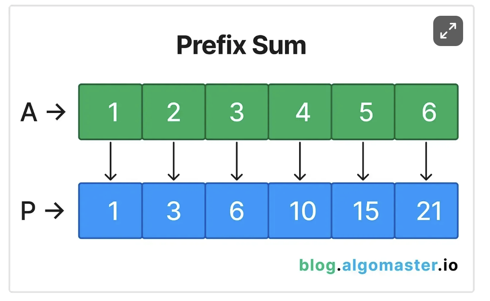

## Overview



Pseudocode

```
for index, element in A:
    if P is empty:
        add element to P at index 0 // This is the first element
        continue
    P[index] = P[index-1] + element
```

This should be an O(n) operation to create the prefix sum array since we traverse over A only 1 time.

The advanced pattern of this is actually storing a hash map which correlates the prefix sum to either an index or a count.
Basically we do that because now if we remove the prefix sum from that index onwards we can check if it will equal a target sum.
This is called prefix sum with hash map pattern.

## Notes

- To find the sum between two elements A1 and A3
  P[3] - P[0] will be the result. We have to subtract 1 from the left index so that in the prefix array we are not including the element at the left index in the sum already. If A0 then you can just return the prefix sum at the right index.

- You can also maintain a prefix hashmap data structure instead where the key will be the difference between certain items - see problem 525

- With the prefix hash map strategy remember that we want to keep removing the prefix subarray and recalculating

## Prefix Pattern Problems:

https://leetcode.com/discuss/general-discussion/563022/prefix-sum-problems
https://leetcode.com/problem-list/xcgv5k25/
https://leetcode.com/discuss/study-guide/5119937/Prefix-Sum-Problems#section-3
